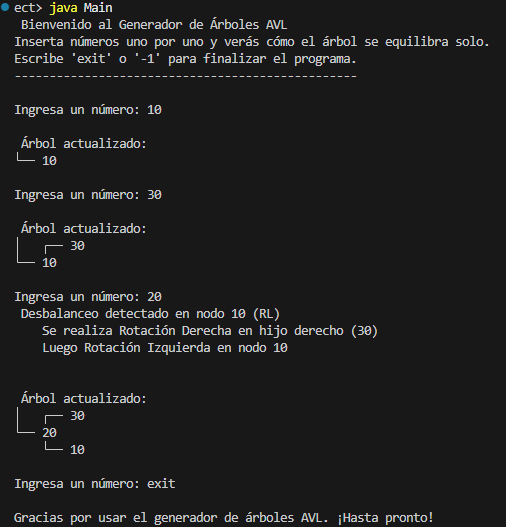
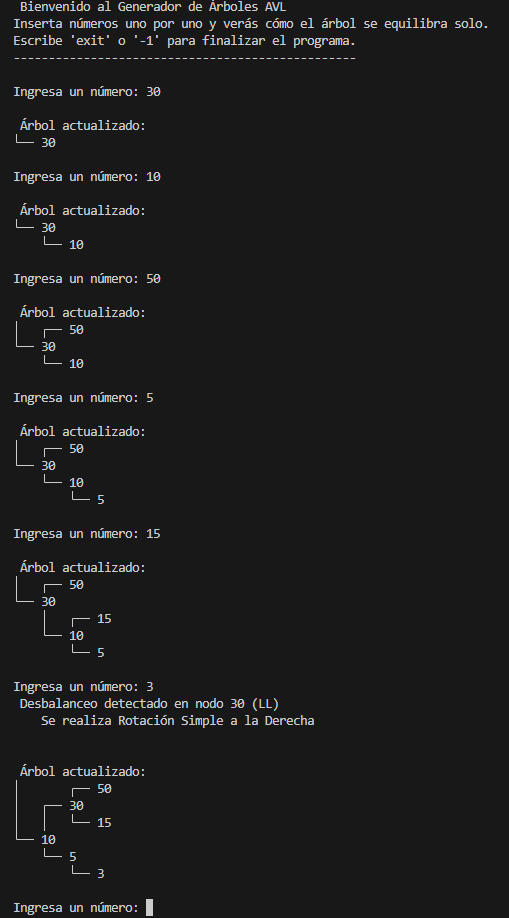

# Generador de Árboles AVL en Java

Este proyecto permite al usuario insertar números desde consola para construir un árbol AVL dinámico.  
Después de cada inserción, el programa evalúa si el árbol está balanceado.  
En caso de desbalance, detecta el tipo (LL, RR, LR o RL) y aplica automáticamente la rotación necesaria.

El árbol se muestra en consola de forma visual y jerárquica. El programa termina cuando el usuario escribe `"exit"` o `-1`.

---

## Objetivo del programa

- Insertar números desde la consola.
- Visualizar el árbol AVL actualizado después de cada inserción.
- Detectar desbalanceos automáticamente y aplicar la rotación adecuada.
- Mostrar en consola qué tipo de rotación se aplicó (LL, RR, LR o RL).
- Finalizar el programa escribiendo `"exit"` o `-1`.

---


 
En esta prueba se insertaron los números 10, 30 y 20 en ese orden.
El nodo 10 se convirtió en raíz, seguido por 30 como hijo derecho.
Al insertar 20, se detectó un desbalance tipo RL (Derecha–Izquierda) en el nodo 10.
El programa aplicó automáticamente una rotación derecha en el hijo derecho (30) y luego una rotación izquierda en el nodo 10, resultando en un árbol balanceado con raíz 20.
 

En esta secuencia se insertaron los números: 30, 10, 50, 5, 15, y 3.
Se observa cómo el árbol se va formando paso a paso, y cómo el programa imprime la estructura actualizada tras cada inserción.
Al insertar el número 3, el nodo 30 se desbalancea con un patrón LL (Izquierda–Izquierda), por lo que se aplica automáticamente una rotación simple a la derecha en el nodo 30.
Esto equilibra el árbol, manteniendo la propiedad AVL sin intervención del usuario.

### Entrada desde consola

```bash
Ingresa un número: 30
Ingresa un número: 20
Ingresa un número: 10
